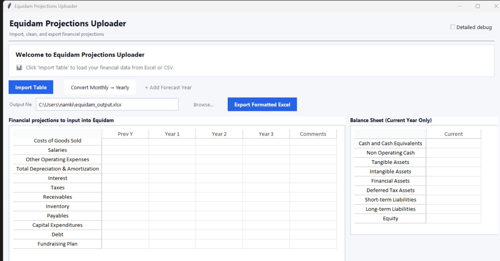

# Equidam Projections Uploader

A desktop tool that automates the process of mapping and uploading financial projections into [Equidam](https://www.equidam.com/), a startup valuation platform.

## The problem

Equidam requires financial data entered into a specific template — fixed row names, fixed column order. Real-world financial models come in dozens of formats: different row labels, merged cells, stacked tables, monthly layouts, multi-sheet workbooks. Manually re-entering data is slow and error-prone.

## What it does

1. **Detects** the financial table in an uploaded Excel file — handles merged cells, blank rows, transposed layouts, and multi-table sheets
2. **Maps** source row labels to Equidam's canonical fields (Revenue, COGS, Salaries, etc.) using fuzzy string matching with alias lookups and exclusion rules
3. **Routes** low-confidence matches to a human review queue before applying them
4. **Exports** the mapped data into a formatted Equidam upload template



## How it works

The mapping pipeline runs in priority order:

| Step | Logic |
|---|---|
| Alias match | Exact match against a curated alias list (e.g. "cost of sales" → COGS) |
| Fuzzy match | `rapidfuzz` WRatio + token_set_ratio + partial_ratio with score caps |
| Exclusion filter | Hard vetoes for clearly wrong matches (e.g. "revenue" blocked from COGS) |
| Token rules | Fields like "Deferred Tax Assets" require specific token combinations |
| Ratio filter | Rows containing %, rate, margin, growth are skipped entirely |
| Dedup | Label-level and value-level deduplication handles stacked/repeated tables |

Matches scoring ≥ 100 are auto-applied. Scores 75–99 go to a review dialog where the user confirms or reassigns. Below 75 are ignored.

## Features

- Multi-sheet scanning with conflict resolution across sheets
- Monthly-to-annual conversion for monthly financial models
- Configurable aliases, thresholds, and exclusion rules via `assets/aliases.json` — no code changes needed
- Rotating log file at `logs/app.log` for debugging

## Setup

```bash
pip install -r requirements.txt
python main.py
```

## Project structure

```
core/           # Data processing pipeline
  table_detector.py     # Finds and normalizes the financial table
  field_mapper.py       # Fuzzy field mapping logic
  field_mapper_utils.py # Scoring, normalization, alias helpers
  importer.py           # Orchestrates the full import
  multi_sheet_scanner.py# Multi-sheet scanning and conflict resolution
  data_handler.py       # Writes output to Equidam template
  monthly_to_annual/    # Monthly-to-yearly aggregation

gui/            # Tkinter desktop UI
  app.py          # Main window and workflow orchestration
  grid_manager.py # Editable data grids
  info_panel.py   # Review queue and audit trail display
  widgets.py      # Scrollable frames and reusable components
  theme.py        # Colors and fonts

assets/
  aliases.json    # Field aliases, thresholds, exclusion rules
```
